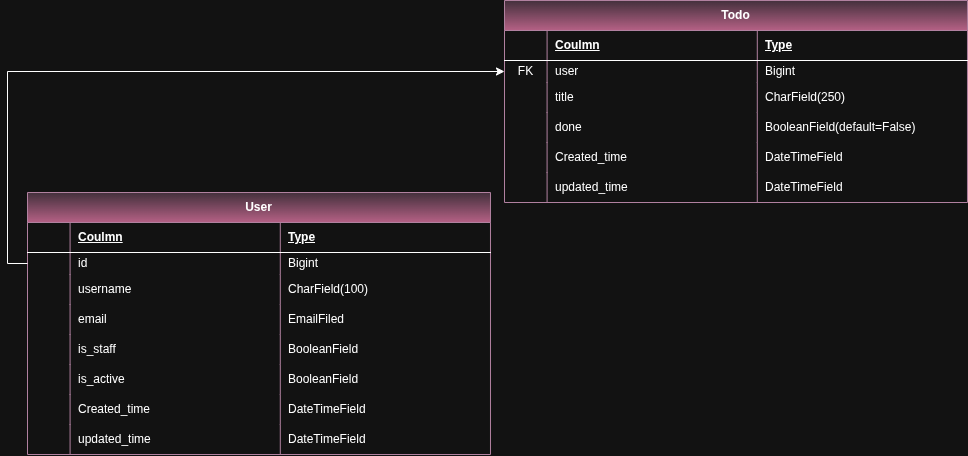

<h1>About the Project</h1> 
This is a simple Todo application built with Django.

<h1>Database Design</h1> 
The database structure is shown in the diagram below:

<h1>Frontend</h1> 
The frontend UI was designed with assistance from AI tools (ChatGPT) and further customized for better user experience and responsiveness.

<h1>Features</h1> 
- Add / edit / delete tasks
- User authentication
- Responsive design

<h1>License</h1> 
This project is open-source and free to use.
